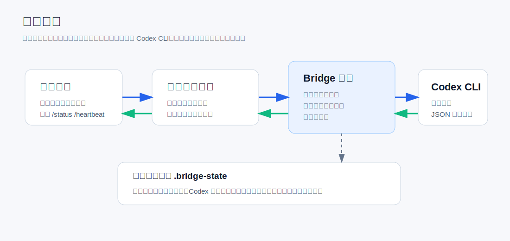
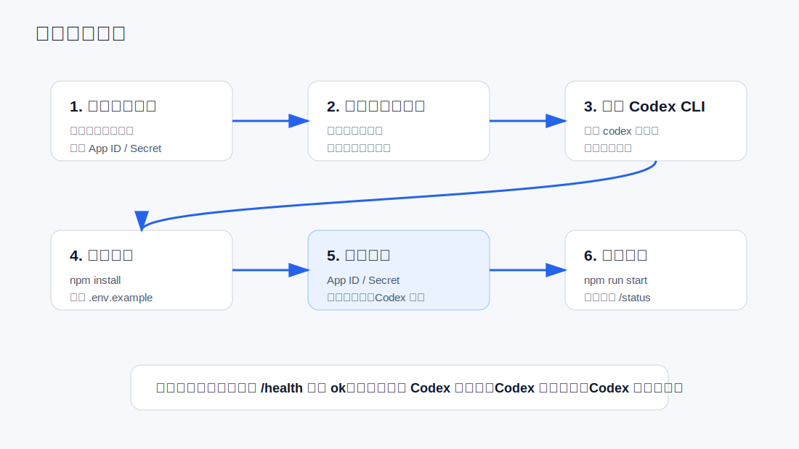
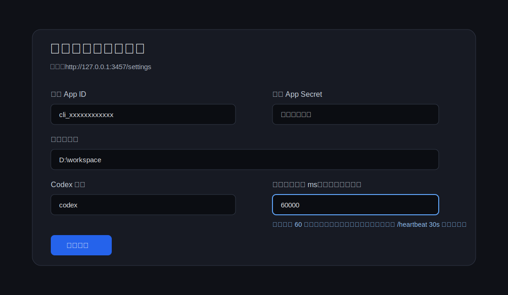
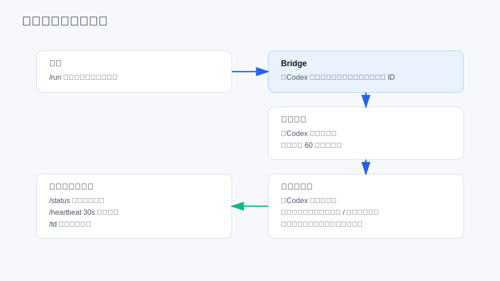

# Feishu Codex Bridge

把本地 Codex CLI 接到飞书机器人里。你在飞书里发消息，电脑上的 Codex 会执行任务，并把进度、心跳、结果发回飞书。



## 适合谁

- 想在飞书里远程调用本地 Codex 的个人或团队。
- 想让 Codex 长任务有进度反馈，不想盯着电脑屏幕等结果的人。
- 不方便配置公网回调地址，希望使用飞书长连接模式的人。

## 功能亮点

- 飞书长连接接入，不需要公网服务器和回调地址。
- 支持直连模式：飞书普通消息直接进入 Codex。
- 支持桥接模式：任务入队、状态跟踪、任务详情、继续任务。
- 长任务会持续向飞书发送心跳。
- 心跳会展示 Codex 可见过程，例如正在执行工具、正在分析、阶段说明。
- 支持 `/heartbeat 30s` 动态调整心跳间隔。
- 管理页可以修改飞书密钥、默认工作区、Codex 命令、心跳间隔等配置。
- 本地保存飞书会话与 Codex `thread_id`，同一个聊天能续接上下文。

## 工作原理

```text
飞书用户
  -> 飞书开放平台长连接
  -> Feishu Codex Bridge
  -> 本地 Codex CLI
  -> Bridge 把进度和结果发回飞书
```

飞书长连接只负责把飞书消息实时推给桥接服务。Codex 的进展来自本地 Codex CLI 的 JSON 事件输出，桥接服务会把可见事件转发给飞书；如果 Codex 暂时没有新事件，会用心跳告诉你“仍在运行”。

## 新手安装流程



## 准备条件

1. Windows 电脑。
2. Node.js 18 或更高版本。
3. 已安装并登录 Codex CLI。
4. 一个飞书企业自建应用。
5. 飞书应用开启机器人能力和事件订阅。

检查 Node：

```powershell
node -v
npm -v
```

检查 Codex：

```powershell
codex --version
```

如果 `codex --version` 不能运行，请先安装并登录 Codex CLI。

## 下载源码

GitHub：

```powershell
git clone https://github.com/lutianding118-cmd/feishu-codex-bridge.git
cd feishu-codex-bridge
```

Gitee：

```powershell
git clone https://gitee.com/luotianding/feishu-codex-bridge2.git
cd feishu-codex-bridge2
```

安装依赖：

```powershell
npm install
```

## 配置 `.env`

复制示例配置：

```powershell
copy .env.example .env
```

打开 `.env`，至少填写这些：

```env
FEISHU_APP_ID=你的飞书 App ID
FEISHU_APP_SECRET=你的飞书 App Secret
FEISHU_VERIFICATION_TOKEN=
DEFAULT_WORKSPACE_DIR=D:\workspace
CODEX_COMMAND=codex
BRIDGE_AUTH_CODE=123456
TASK_HEARTBEAT_MS=60000
```

字段说明：

| 字段 | 说明 |
| --- | --- |
| `FEISHU_APP_ID` | 飞书开放平台里的 App ID |
| `FEISHU_APP_SECRET` | 飞书开放平台里的 App Secret |
| `FEISHU_VERIFICATION_TOKEN` | 长连接模式通常不用，保留为空也可以 |
| `DEFAULT_WORKSPACE_DIR` | Codex 默认在哪个目录执行任务 |
| `CODEX_COMMAND` | Codex 命令，通常填 `codex` |
| `BRIDGE_AUTH_CODE` | 管理页登录授权码 |
| `TASK_HEARTBEAT_MS` | 飞书进度心跳间隔，默认 `60000` 即 60 秒 |

不要把你自己的 `.env` 上传到仓库。本项目已经用 `.gitignore` 忽略 `.env`。

## 启动服务

```powershell
npm run start
```

看到类似下面的信息说明服务启动了：

```text
=== Feishu x Codex Bridge (WS Mode) ===
[Bridge] Admin: http://localhost:3457
```

打开管理页：

```text
http://127.0.0.1:3457
```

默认授权码看 `.env` 里的：

```env
BRIDGE_AUTH_CODE=123456
```

健康检查：

```text
http://127.0.0.1:3457/health
```

正常时应该看到：

```json
{
  "status": "ok",
  "codex": true
}
```

## 管理页设置



管理页地址：

```text
http://127.0.0.1:3457/settings
```

可以修改：

- 飞书 App ID
- 飞书 App Secret
- 飞书 Verification Token
- 管理页授权码
- 默认工作区
- Codex 命令
- Codex 模型
- 飞书消息模式
- 默认心跳间隔
- 回复长度
- 沙盒开关

飞书 App ID / Secret 修改后建议重启服务。

## 飞书应用怎么配

在飞书开放平台创建企业自建应用后，按下面检查：

1. 进入应用后台。
2. 打开“凭证与基础信息”，复制 `App ID` 和 `App Secret`。
3. 打开“应用能力”，启用机器人。
4. 打开“事件订阅”，使用长连接模式。
5. 订阅接收消息事件，常见事件名为 `im.message.receive_v1`。
6. 发布应用或把应用安装到测试企业。
7. 把机器人拉进群聊，或直接私聊机器人。

配置好后，在飞书里发送：

```text
/status
```

如果收到运行状态，说明链路通了。

## 飞书端进度反馈



当你发送一个需求后，飞书会陆续收到：

```text
【Codex 已收到】
【Codex 开始处理】
【Codex 进展】
【Codex 仍在运行】
【Codex 已完成】
```

运行中心跳示例：

```text
【Codex 仍在运行】
内容: 帮我修复项目构建失败
模式: 直连模式
已运行: 5分0秒
可见过程: 正在执行工具: shell_command
队列: 当前会话没有等待项
建议: 当前会话忙，新指令会排队；如果是同一个任务，建议先等待当前结果或用 /status 查看。
```

能展示的可见过程包括：

- Codex 阶段说明。
- 正在执行哪个工具。
- 工具执行完成。
- 命令、文件路径、URL、查询词等摘要。
- 正在分析任务。
- 正在整理回复。

不会展示模型内部隐藏推理全文。Codex CLI 不一定暴露完整隐藏推理，桥接服务只转发可见阶段事件和安全摘要。

## 飞书常用命令

| 命令 | 说明 |
| --- | --- |
| `/status` | 查看 Codex 状态、当前会话忙闲、队列、最近进展 |
| `/heartbeat` | 查看当前心跳间隔 |
| `/heartbeat 30s` | 把心跳改成 30 秒 |
| `/hb 2m` | 把心跳改成 2 分钟 |
| `/mode` | 查看当前消息模式 |
| `/mode direct` | 切换到直连模式 |
| `/mode bridge` | 切换到桥接模式 |
| `/run <任务内容>` | 创建可跟踪任务 |
| `/list` | 查看所有未完成任务 |
| `/task` | 查看当前聊天任务 |
| `/td` | 查看当前聊天第一个任务详情 |
| `/td <序号或任务ID>` | 查看指定任务详情 |
| `/workspace` | 查看当前工作区 |
| `/workspace <路径>` | 切换当前飞书会话工作区 |
| `/reset` | 清除当前 Codex 会话标识 |

## 两种消息模式

### 直连模式

```env
FEISHU_MESSAGE_MODE=direct
```

普通飞书消息直接进入 Codex。适合日常问答、快速执行、个人使用。

### 桥接模式

```env
FEISHU_MESSAGE_MODE=bridge
```

桥接服务会识别消息意图，把执行类请求放进任务队列。适合团队使用、长任务跟踪、需要 `/list` 和 `/td` 的场景。

无论当前模式是什么，显式发送 `/run <任务内容>` 都会创建可跟踪任务。

## Windows 服务运行

如果你想开机自动启动，可以使用 Windows 服务包装器。先准备 WinSW：

```powershell
powershell -ExecutionPolicy Bypass -File .\scripts\prepare-service-wrapper.ps1
```

然后用管理员 PowerShell 运行：

```powershell
.\install-service.ps1
```

查看状态：

```powershell
.\status-service.ps1
```

停止服务：

```powershell
.\stop-service.ps1
```

卸载服务：

```powershell
.\uninstall-service.ps1
```

注意：Codex 登录态通常在当前 Windows 用户目录。服务如果用 LocalSystem 运行，可能读不到 Codex 登录态。建议让服务运行在已经登录过 Codex 的 Windows 用户下。

## 单文件安装包

如果你要发给不懂技术的人，可以生成单文件安装包：

```powershell
powershell -ExecutionPolicy Bypass -File .\scripts\build-onefile-installer.ps1
```

生成：

```text
dist\FeishuCodexBridge-OneClick-Setup.exe
```

这个安装包会使用 `.env.example` 作为初始配置，不会打包你自己的 `.env` 密钥。

## 本地状态文件

运行过程中会生成：

```text
.bridge-state\sessions.json
.bridge-state\tasks.json
.bridge-state\messages.json
.bridge-state\codex-runs.json
```

这些文件只在本机使用，不应该提交到仓库。

## 常见问题

### 飞书没有回复

检查：

- `npm run start` 是否还在运行。
- `.env` 里的 App ID / Secret 是否正确。
- 飞书应用是否启用了机器人能力。
- 飞书事件订阅是否使用长连接模式。
- 机器人是否已经加入群聊或私聊。

### 管理页显示 Codex 不可用

先在终端执行：

```powershell
codex --version
```

如果失败，说明 Codex CLI 没装好或没登录。先修好 Codex，再启动桥接服务。

### 心跳太慢或太快

在飞书里发送：

```text
/heartbeat 30s
```

或者在管理页修改“默认心跳间隔 ms（飞书进度反馈）”。

### 修改飞书密钥后不生效

App ID / Secret 是启动时创建飞书客户端用的，修改后建议重启服务。

## 安全提醒

- 不要提交 `.env`。
- 不要把 App Secret 发到群里。
- 不要把 `.bridge-state` 上传到公开仓库。
- 如果曾经误传密钥，请立刻到飞书开放平台重置 App Secret。

## 开源协议

MIT License，见 [LICENSE](LICENSE)。
